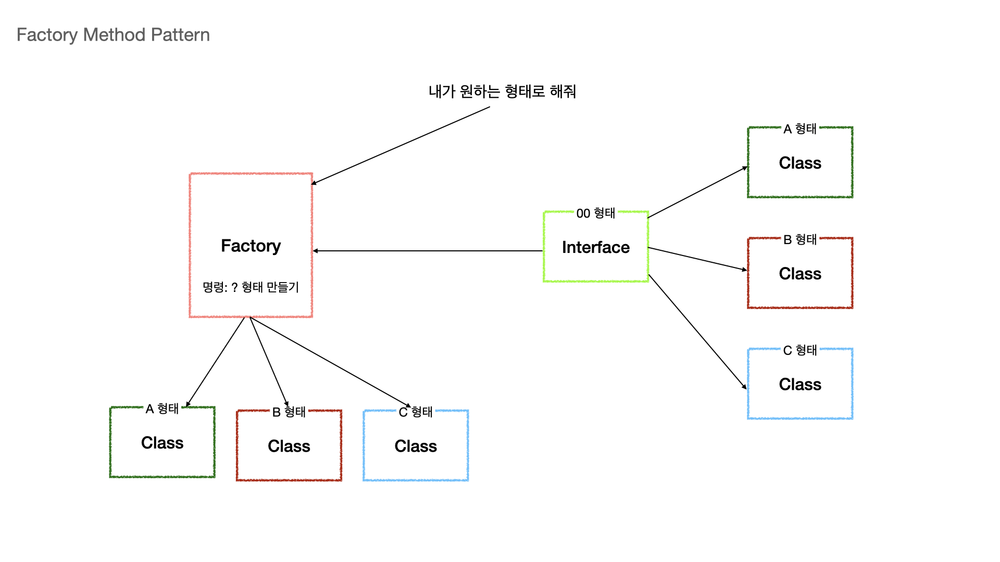
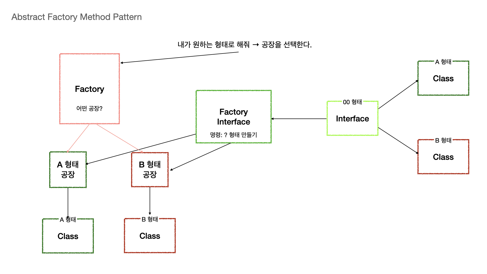

# 추상 팩토리 패턴

관련있는 여러개의 인스턴스를 만들어주는 인터페이스로 분리하여 생성하는 패턴

### 팩토리 메서드

팩토리메서드는 인자 타입에 따라 여러타입의 객체를 반환

팩토리메서드는 구체적인 클래스에서 객체를 생성

 

### 추상 팩토리

추상 팩토리 패턴은 이 추상 팩토리의 구현체에 존재하는 각각의 메서드들은 한가지 종류의 객체만 반환을 한다.

추상팩토리는 인터페이스를 통해 생성

### 팩토리 메소드 패턴과 뭐가 다른가?

이창섭이 생각한 두 디자인 패턴의 차이 

→ **팩토리 메소드 패턴**은 구체적인 인스턴스를 만드는 과정을 Factory로 감춰서 만드는 방식: 팩토리를 구현하는 방법. ⇒  **구체적인** 객체 생성 과정을 하위 또는 구체적 클래스에 옮기는게 목적.

→ **추상팩토리**는 구체적인 인스턴스를 : 사용하는 방법에 초점을 둠. ⇒ 여러 객체를 구체적인 클래스에 **의존적이지 않게** 해주는게 목적.

### 구체적인 차이점

1. Factory 클래스에서 객체에 대한 생성을 지원하는 범위
   - 팩토리 메소드 패턴
     - 한 팩토리당 한 종류 ( create 메서드가 Factory 클래스에 1개) ⇒ **뭐** 만들어줘→ **뭐만 내가 결정하면됨.**
     - 한 개의 메서드로 여러 개의 객체를 만듦
   - 추상 팩토리 패턴
     - 한 팩토리에서 서로 연관된 여러 종류 모두 지원( create() 메서드가 팩토리 클래스에 여러 개)
       - **A로 만들어** → **A**를 만들어줌 , **B로 만들어** → **B**를 만들어줌 (선택지 자체에 구체적인 뭘 만들어달라는게 있음, 선택지 자체를 만들어서 줌.)
     - 구상 클래스에 의존하지 않고 여러 개의 관련된 객체를 하나의 팩토리로 묶음
2. 팩토리 메서드에서 만드는 객체의 종류
   - 팩토리 메소드 패턴의 팩토리 메소드
     - 인자에 따라 객체의 종류가 결정됨 → 만들어줘 A → A클래스를 골라서 인스턴스 생성
   - 추상 팩토리 패턴 패턴의 팩토리 메서드
     - 인자에 따라 관련된 객체들을 생성하는 팩토리의 종류가 결정됨  → A 만들어줘 하면 → A Factory를 골라서 만듬.
3. 결합도를 낮추는 대상
   - 팩토리 메서드 패턴
     - ConcreteProduct와 Client 간의 결합도를 낮출때 사용
   - 추상 팩토리 패턴
     - ConcreteFactory와 Client간의 결합도를 낮출 때 사용
4. 포커스
   - 팩토리 메서드 패턴
     - 메서드(Factory Method) 레벨에서 포커스를 맞춤
     - 클라이언트의 ConcreteProduct 인스턴스 생성 및 구성에 대한 책임을 덜어줌
   - 추상 팩토리 패턴
     - 클래스(Abstract Factory) 레벨에서 포커스를 맞춤
     - 각 Product들이 다른 클래스와 함께 사용될 때의 제약사항을 강제할 수 있다.
     - 단, 새로운 ConcreteFactory를 추가할 때 많은 작업이 필요하다.
5. 메서드와 오브젝트
   - 팩토리 메서드는 단일 Method이다
   - 추상 팩토리는 Object이다. (팩토리 오브젝트 생성)
6. Inhritance(상속), Composition(구성)
   - 팩토리 메서드 패턴
     - 상속을 사용하여 객체의 인스턴스 생성에 대해서는 서브클래스에 의존
     - 지역 레퍼런스 없이 바로 하위 클래스의 함수를 호출하여 객체를 만듦
   - 추상 팩토리 패턴
     - 지역 레퍼런스를 두어 , 외부로부터 Factory 객체를 DI 받아서 위임.

[factory method pattern vs abstract factory pattern 차이 알아보기](https://beomseok95.tistory.com/246)

### 어디서 찾아볼것인가?

- java.xml 파일
  - DocumentBuilderFactory
- Spring FactoryBean
  - 인터페이스인데, 이걸 구현 받아서→ 등록만 해놓으면 Bean으로 이 객체가 쭉쭉 나오는 방식.
  - Factory등록해놓으면 Ship.class를 통해서 빈을가져오면 알아서 Factory에서 빼서 가져오는 방식